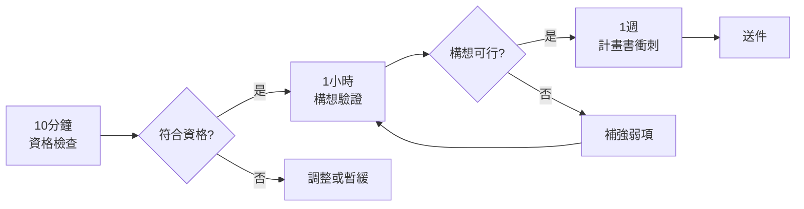
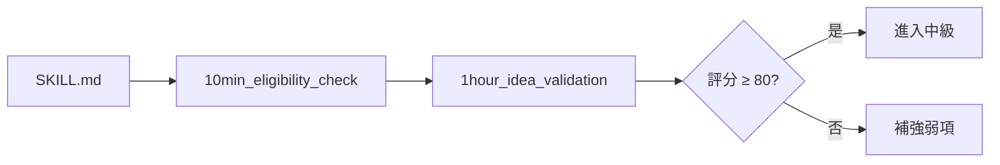

# 🚀 SBIR Grants - AI 驅動的 SBIR 申請輔助系統

<div align="center">

[](https://opensource.org/licenses/MIT)
[]()
[]()
[]()
[]()

**從資格評估到計畫書撰寫，一站式 SBIR 申請解決方案**

[📦 安裝指南](INSTALLATION.md) • [🚀 快速開始](GETTING_STARTED.md) • [💡 核心功能](#-核心功能) • [📁 專案結構](#-專案結構)

</div>

---

## 🎯 為什麼選擇 SBIR Skill？

### 傳統方式 vs SBIR Skill

| 項目 | 傳統方式 | SBIR Skill | 提升 |
|------|----------|-----------|------|
| **資格評估** | 自行摸索 | **10 分鐘**快速檢查 | ⚡ 快 20 倍 |
| **構想驗證** | 1-2 週 | **1 小時**系統驗證 | ⚡ 快 100 倍 |
| **計畫書撰寫** | 2-3 個月 | **1 週**完成初稿 | ⚡ 快 10 倍 |
| **常見問題** | 到處查資料 | **81 個**即時解答 | 💡 一站解決 |
| **品質保證** | 憑經驗 | **5 個**系統檢核 | ✅ 零遺漏 |
| **成功率** | 40-50% | **顯著提升** | 📈 數據驅動 |

---

## ⚡ 快速開始

### 3 步驟開始使用

```bash
# 1️⃣ 10 分鐘資格檢查
閱讀 quick_start/10min_eligibility_check.md

# 2️⃣ 1 小時構想驗證
使用 quick_start/1hour_idea_validation.md

# 3️⃣ 開始撰寫
參考 templates/phase1_proposal.md
使用 references/methodology_*.md
```

### 🎬 完整流程



---

## 🎨 核心功能

### 1️⃣ 系統性方法論（6 個完整框架）

<table>
<tr>
<td width="50%">

**📝 問題陳述**
- 三段式論證法
- 客戶訪談問題清單
- 缺口分析矩陣

**💡 創新論述**
- 創新類型定位
- 差異化分析
- 技術門檻論證

**📊 市場分析**
- TAM/SAM/SOM 計算
- 客戶驗證流程
- 商業模式設計

</td>
<td width="50%">

**🔬 可行性評估**
- TRL 評估框架
- 風險識別與對策
- 驗證計畫設計

**👥 團隊組建**
- 能力需求分析
- 角色定義與分工
- 能力矩陣驗證

**💰 經費規劃**
- WBS 工作分解
- 成本效益分析
- 比例檢查

</td>
</tr>
</table>

### 2️⃣ 全面的 FAQ 資料庫（81 個問題）

```
📋 資格相關（20 題） → 公司資格、產業資格、人員資格
📋 申請流程（13 題） → 時程、審查、線上申請
📋 經費相關（20 題） → 編列規定、核銷流程
📋 審查相關（13 題） → 評分標準、簡報技巧
📋 執行相關（15 題） → 查核點、成果繳交
```

### 3️⃣ 品質保證體系

**5 個檢核清單 + 4 個評分標準**

- ✅ 申請前檢核（40+ 項目，含評分系統）
- ✅ Phase 1/2 撰寫檢核
- ✅ 經費檢核、送件前檢核
- 📊 創新性、可行性、市場性、團隊能力評分標準

### 4️⃣ 實戰案例學習

**4 個詳細案例研究**

| 產業 | 類型 | 評分 | 亮點 |
|------|------|------|------|
| 🔧 機械 | 成功案例 | 92 分 | AI 五軸加工補償系統 |
| 💻 資通訊 | 成功案例 | 88 分 | 中小企業 AI 客服 SaaS |
| 🛒 服務業 | 成功案例 | 86 分 | 智慧零售數據分析 |
| ❌ 失敗案例 | 失敗分析 | 62 分 | 5 大失敗原因剖析 |

### 5️⃣ 快速啟動包

```
⏱️  10 分鐘資格檢查    → 快速判斷是否適合申請
🕐  1 小時構想驗證     → 評分系統（≥80 分可申請）
📅  1 週計畫書衝刺     → 完整時程規劃（Day 1-7）
```

### 6️⃣ 混合式數據查詢（MCP Server）

```python
# 自動整合多個數據來源
✓ 經濟部統計處 API（MCP Server）
✓ 工研院 IEK（Claude search_web）
✓ 資策會 MIC（Claude search_web）
✓ 本地數據資料庫（JSON）
```

---

## 📁 專案結構

```
sbir-grants/
├── 📖 SKILL.md                    # Skill 主文件（477 行完整指引）
├── 📘 README.md                   # 本文件
├── 📗 FAQ.md                      # 整合版 FAQ（81 題）
├── 📙 CONTRIBUTING.md             # 貢獻指南
├── 📕 TROUBLESHOOTING.md          # 疑難排解
│
├── 📂 references/                 # 參考資料（6 個方法論 + 4 個評分標準）
│   ├── methodology_problem_statement.md      # 問題陳述方法論
│   ├── methodology_innovation.md             # 創新論述方法論
│   ├── methodology_market_analysis.md        # 市場分析方法論
│   ├── methodology_feasibility.md            # 可行性評估方法論
│   ├── methodology_team_building.md          # 團隊組建方法論
│   ├── methodology_budget_planning.md        # 經費規劃方法論
│   ├── review_criteria/                      # 審查評分標準
│   │   ├── review_criteria_innovation.md     # 創新性評分（90-100 分定義）
│   │   ├── review_criteria_feasibility.md    # 可行性評分
│   │   ├── review_criteria_market.md         # 市場性評分
│   │   └── review_criteria_team.md           # 團隊能力評分
│   ├── phase1_strategy.md                    # Phase 1 策略
│   ├── phase2_strategy.md                    # Phase 2 策略
│   ├── budget_preparation.md                 # 經費編列指引
│   ├── industry_specific_guidance.md         # 6 大產業別指引
│   └── claude_automation_guide.md            # Claude 自動化指引
│
├── 📂 templates/                  # 範本（3 個完整範本）
│   ├── phase1_proposal.md                    # Phase 1 計畫書範本
│   ├── phase2_proposal.md                    # Phase 2 計畫書範本
│   └── budget_template.md                    # 經費範本
│
├── 📂 examples/                   # 範例
│   ├── case_studies/                         # 實戰案例（4 個）
│   │   ├── case_study_machinery.md           # 機械產業成功案例
│   │   ├── case_study_ict.md                 # 資通訊產業成功案例
│   │   ├── case_study_services.md            # 服務業成功案例
│   │   └── case_study_failure_analysis.md    # 失敗案例分析
│   ├── before_after_innovation.md            # 創新論述改寫範例
│   ├── market_analysis_data.md               # 市場數據來源指引
│   └── successful_cases.md                   # 成功案例分析
│
├── 📂 faq/                        # 常見問題（5 個主題，81 題）
│   ├── faq_eligibility.md                    # 資格 FAQ（20 題）
│   ├── faq_application_process.md            # 申請流程 FAQ（13 題）
│   ├── faq_budget.md                         # 經費 FAQ（20 題）
│   ├── faq_review.md                         # 審查 FAQ（13 題）
│   └── faq_execution.md                      # 執行 FAQ（15 題）
│
├── 📂 checklists/                 # 檢核清單（5 個）
│   ├── pre_application_checklist.md          # 申請前檢核（含評分系統）
│   ├── writing_checklist_phase1.md           # Phase 1 撰寫檢核
│   ├── writing_checklist_phase2.md           # Phase 2 撰寫檢核
│   ├── budget_checklist.md                   # 經費檢核
│   └── submission_checklist.md               # 送件前檢核
│
├── 📂 quick_start/                # 快速啟動（3 個指南）
│   ├── 10min_eligibility_check.md            # 10 分鐘資格檢查
│   ├── 1hour_idea_validation.md              # 1 小時構想驗證
│   └── 1week_proposal_sprint.md              # 1 週計畫書衝刺
│
├── 📂 data/                       # 數據資料庫（JSON）
│   ├── industry_statistics_machinery.json    # 機械產業統計
│   └── industry_statistics_ict.json          # 資通訊產業統計
│
└── 📂 mcp-server/                 # MCP Server（混合式數據查詢）
    ├── server.py                             # MCP Server 實作
    ├── pyproject.toml                        # 依賴配置
    └── README.md                             # 安裝與使用說明
```

**統計數據**：
- 📊 **54 個檔案**（49 個 Markdown + 2 個 JSON + 3 個 Python/配置）
- 📝 **80,000+ 字**詳細指引
- 📋 **200+ 個表格**
- ✅ **150+ 個檢核項目**

---

## 💡 使用情境

### 情境 1：完全新手 🆕

> 「我第一次申請 SBIR，完全不知道從何開始」

**推薦流程**：
```
1. 📖 閱讀 SKILL.md（了解 SBIR 是什麼）
2. ⏱️  quick_start/10min_eligibility_check.md（檢查資格）
3. 🕐 quick_start/1hour_idea_validation.md（驗證構想）
4. ✅ checklists/pre_application_checklist.md（完整評估）
5. 📝 開始撰寫計畫書
```

### 情境 2：有草稿需要優化 📝

> 「我已經寫了初稿，但不確定是否符合標準」

**推薦流程**：
```
1. ✅ 使用 checklists/writing_checklist_phase1.md（或 phase2）
2. 📊 參考 review_criteria/（了解評分標準）
3. 📖 使用各章節方法論優化內容
4. ✅ 使用 checklists/submission_checklist.md（最終檢查）
```

### 情境 3：特定章節卡關 🤔

> 「我不知道如何寫市場分析」

**推薦流程**：
```
1. 📖 閱讀 references/methodology_market_analysis.md
2. 📊 參考 examples/market_analysis_data.md（數據來源）
3. 📝 使用 templates/phase1_proposal.md（填寫範本）
4. ✅ 用檢核清單確認完整性
```

### 情境 4：時間緊迫 ⏰

> 「距離截止日只剩 1 週！」

**推薦流程**：
```
1. 📅 使用 quick_start/1week_proposal_sprint.md
2. 📝 Day 1-2：資料收集
3. 📝 Day 3-4：撰寫初稿
4. 📝 Day 5：審閱修改
5. 📝 Day 6：簡報製作
6. 📝 Day 7：最終檢查
```

---

## 🎓 學習路徑

### 初級（1-2 小時）



### 中級（1-2 週）

- 📖 閱讀 6 個方法論
- 📝 使用範本撰寫初稿
- ✅ 使用檢核清單確認

### 高級（持續優化）

- 📊 研究案例庫
- 📈 了解評分標準
- 🎯 針對性優化

---

## 📊 SBIR vs NSTC 比較

| 項目 | SBIR（經濟部） | NSTC（國科會） |
|------|---------------|---------------|
| **目標** | 💼 商業化創新 | 🔬 學術研究 |
| **申請者** | 🏢 中小企業 | 🎓 學術機構、企業 |
| **Phase 1** | 💰 最高 100 萬（全額） | - |
| **Phase 2** | 💰 最高 3,000 萬 | 依計畫類型 |
| **重點** | 📈 市場價值、商業模式 | 📚 學術貢獻、研究創新 |
| **執行期** | ⏱️ Phase 1: 6 個月<br/>Phase 2: 2 年 | 依計畫類型 |

---

## 🚀 SBIR 階段說明

### Phase 1（先期研究）

<table>
<tr>
<td width="25%"><b>💰 補助金額</b></td>
<td width="75%">最高 100 萬（<b>全額補助</b>）</td>
</tr>
<tr>
<td><b>⏱️ 執行期間</b></td>
<td>6 個月</td>
</tr>
<tr>
<td><b>🎯 目標</b></td>
<td>驗證技術可行性</td>
</tr>
<tr>
<td><b>🔬 TRL</b></td>
<td>3-4 → 4-5</td>
</tr>
<tr>
<td><b>📝 格式</b></td>
<td>簡報格式（12-15 頁）</td>
</tr>
<tr>
<td><b>📊 通過率</b></td>
<td>約 40-50%</td>
</tr>
</table>

### Phase 2（研發執行）

<table>
<tr>
<td width="25%"><b>💰 補助金額</b></td>
<td width="75%">最高 3,000 萬（需自籌 ≥ 20%）</td>
</tr>
<tr>
<td><b>⏱️ 執行期間</b></td>
<td>2 年</td>
</tr>
<tr>
<td><b>🎯 目標</b></td>
<td>開發可商業化產品</td>
</tr>
<tr>
<td><b>🔬 TRL</b></td>
<td>5-6 → 7-8</td>
</tr>
<tr>
<td><b>📝 格式</b></td>
<td>完整計畫書（30-40 頁）</td>
</tr>
<tr>
<td><b>📊 通過率</b></td>
<td>約 25-35%</td>
</tr>
</table>

---

## 🎯 成功關鍵指標

### 創新性（25-30%）

```
✓ 明確的創新點（3-5 個）
✓ 量化效益（準確率提升 X%）
✓ 競品比較表
✓ 技術門檻說明
```

### 可行性（25-30%）

```
✓ TRL 評估合理
✓ 團隊經驗豐富
✓ 時程規劃詳細
✓ 風險識別完整
```

### 市場性（20-25%）

```
✓ TAM/SAM/SOM 計算
✓ 客戶驗證證據
✓ 商業模式清楚
✓ 競爭分析完整
```

### 團隊能力（15-20%）

```
✓ 主持人經驗 ≥ 3 年
✓ 團隊涵蓋所需專業
✓ 核心成員投入 ≥ 50%
✓ 有過往實績
```

---

## 🔗 官方資源

- 🌐 **SBIR 官方網站**：https://www.sbir.org.tw/
- 🏢 **經濟部中小及新創企業署**：https://www.moeasmea.gov.tw/
- 📞 **服務專線**：0800-888-968
- 📊 **經濟部統計處**：https://www.moea.gov.tw/Mns/dos/
- 🔬 **工研院 IEK**：https://iek.itri.org.tw/
- 💻 **資策會 MIC**：https://mic.iii.org.tw/

---

## 🤝 貢獻

歡迎貢獻！請參考 [CONTRIBUTING.md](CONTRIBUTING.md)

### 貢獻類型

- 📝 新的方法論
- 📊 實戰案例（需為合成範例）
- ❓ FAQ 問題與解答
- 🐛 錯誤修正
- 📖 文件改進

---

## 📄 授權

本專案採用 [MIT License](LICENSE)

---

## 🙏 致謝

感謝所有為台灣中小企業創新努力的人們。

---

## 📞 取得協助

### 遇到問題？

1. 📖 查看 [FAQ.md](FAQ.md)（81 個常見問題）
2. 📕 查看 [TROUBLESHOOTING.md](TROUBLESHOOTING.md)
3. 📞 撥打 SBIR 服務專線：0800-888-968

### 快速連結

- [10 分鐘資格檢查](quick_start/10min_eligibility_check.md)
- [1 小時構想驗證](quick_start/1hour_idea_validation.md)
- [1 週計畫書衝刺](quick_start/1week_proposal_sprint.md)
- [申請前檢核清單](checklists/pre_application_checklist.md)

---

<div align="center">

**🚀 開始使用 SBIR Skill，讓 AI 協助您成功申請 SBIR 補助！**

Made with ❤️ for Taiwan SMEs

</div>
