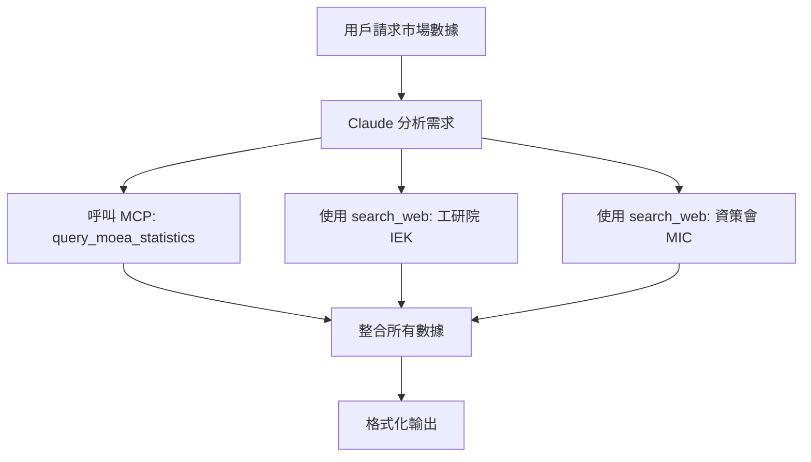

# SBIR Data MCP Server

混合式市場數據查詢服務，整合台灣官方與法人機構數據來源。

## 🎯 設計理念：混合式架構

本 MCP Server 採用**混合式設計**，結合 MCP Server 與 Claude 內建工具的優勢：

| 數據來源 | 查詢方式 | 原因 |
|---------|---------|------|
| 📊 經濟部統計處 | **MCP Server** | 有官方 API，適合結構化查詢 |
| 🔬 工研院 IEK | **Claude `search_web`** | 無公開 API，需網頁搜尋 |
| 💻 資策會 MIC | **Claude `search_web`** | 無公開 API，需網頁搜尋 |

### 為什麼是混合式？

**MCP Server 的限制**：
- ❌ 無法直接呼叫 Claude 的 `search_web` 工具
- ❌ 實作 web scraping 複雜且維護成本高
- ❌ Google Custom Search API 需要額外費用

**解決方案**：
- ✅ MCP Server 專注於**有 API 的數據源**（經濟部統計處）
- ✅ Claude 使用內建 `search_web` 處理**需要搜尋的數據源**（IEK、MIC）
- ✅ `references/claude_automation_guide.md` 指導 Claude 如何協調兩者

---

## 🛠️ 功能

### 可用工具

#### 1. `query_moea_statistics`

查詢經濟部統計處總體統計資料庫。

**參數**：
- `industry`: 產業別（機械、化工、電子、資通訊、生技、服務業）
- `stat_type`: 統計類型（產值、出口、就業人數）
- `start_year`: 起始年份（預設 2020）
- `end_year`: 結束年份（預設 2024）

**範例**：
```python
query_moea_statistics(
    industry="機械",
    stat_type="產值",
    start_year=2020,
    end_year=2024
)
```

**目前狀態**：
- ⚠️ 回傳說明訊息與建議
- ⚠️ 實際 API 查詢需要「功能代碼」（較複雜）
- ✅ 建議使用 Claude `search_web` 作為替代方案

#### 2. `search_moea_website`

提供經濟部網站搜尋建議。

**參數**：
- `keyword`: 搜尋關鍵字

**功能**：
- 提供搜尋建議
- 推薦使用 Claude `search_web` 的查詢語法
- 列出推薦查詢網站

---

## 📋 完整查詢流程

根據 `references/claude_automation_guide.md`，Claude 會自動執行以下流程：



**範例對話**：

```
用戶：「我要寫機械產業的問題陳述，請幫我找市場數據」

Claude 自動執行：
1. 呼叫 MCP Server: query_moea_statistics(industry="機械", stat_type="產值")
2. 使用 search_web: "機械產業 市場規模 site:iek.itri.org.tw"
3. 整合結果並格式化

Claude 回應：
「根據經濟部統計處，2024 年台灣機械產業產值約 1,200 億元...
根據工研院 IEK 報告，機械產業年複合成長率預估為 5.2%...」
```

---

## 🚀 安裝

### 1. 安裝依賴

```bash
cd /Users/backtrue/Documents/claude-sbir-skills/sbir-grants/mcp-server

# 使用 uv（推薦）
uv pip install -e .

# 或使用 pip
pip install -e .
```

### 2. 設定 Claude Desktop

編輯設定檔：

**macOS**: `~/Library/Application Support/Claude/claude_desktop_config.json`

```json
{
  "mcpServers": {
    "sbir-data": {
      "command": "uv",
      "args": [
        "--directory",
        "/Users/backtrue/Documents/claude-sbir-skills/sbir-grants/mcp-server",
        "run",
        "server.py"
      ]
    }
  }
}
```

### 3. 重啟 Claude Desktop

設定完成後，重啟 Claude Desktop 即可使用。

---

## 📖 使用指南

### 自動觸發（推薦）

Claude 會根據 `references/claude_automation_guide.md` 自動判斷何時使用 MCP Server。

**觸發情境**：
- 用戶提到「市場數據」、「產業統計」
- 撰寫問題陳述、市場分析章節
- 需要產值、出口、就業等數據

### 手動呼叫

也可以明確要求：

```
「請使用 MCP Server 查詢機械產業的產值數據」
```

---

## 🔧 開發指引

### 測試 Server

```bash
# 直接執行
python server.py

# 使用 MCP Inspector（推薦）
npx @modelcontextprotocol/inspector uv --directory . run server.py
```

### 擴充功能

如需新增數據來源：

1. **有 API 的數據源** → 在 `server.py` 新增工具
2. **需搜尋的數據源** → 更新 `references/claude_automation_guide.md`

---

## ✅ 目前狀態

### 已完成

- ✅ MCP Server 基本架構
- ✅ 工具定義（query_moea_statistics, search_moea_website）
- ✅ 錯誤處理與指引訊息
- ✅ Claude 自動化指引文件

### 待優化（可選）

- [ ] 實作經濟部 API 功能代碼查詢
- [ ] 快取機制（避免重複查詢）
- [ ] 更多產業數據源

**注意**：由於經濟部 API 需要「功能代碼」且查詢複雜，目前建議直接使用 Claude 的 `search_web` 作為主要方案。MCP Server 提供架構與指引。

---

## 📚 相關文件

- `references/claude_automation_guide.md` - Claude 自動化指引（**重要**）
- `examples/market_analysis_data.md` - 市場數據來源指引
- `data/industry_statistics_*.json` - 本地數據資料庫

---

## 🤝 貢獻

歡迎貢獻！特別是：
- 新增產業數據來源
- 改進數據格式化
- 優化查詢邏輯

---

## 📄 授權

MIT License


混合式市場數據查詢服務，整合台灣官方與法人機構數據來源。

## 功能

### 數據來源

| 來源 | 類型 | 說明 |
|------|------|------|
| 經濟部統計處 | Web Search | 官方產業統計數據 |
| 工研院 IEK | Web Search | 產業趨勢報告 |
| 資策會 MIC | Web Search | 資通訊產業數據 |

### 可用工具

1. **get_industry_market_data**
   - 查詢特定產業的市場數據
   - 自動整合多個來源
   - 參數：產業別、關鍵字、年份

2. **search_moea_statistics**
   - 直接查詢經濟部統計處
   - 參數：查詢關鍵字

## 安裝

```bash
cd /Users/backtrue/Documents/claude-sbir-skills/sbir-grants/mcp-server

# 使用 uv 安裝（推薦）
uv pip install -e .

# 或使用 pip
pip install -e .
```

## 設定 Claude Desktop

編輯 Claude Desktop 設定檔：

**macOS**: `~/Library/Application Support/Claude/claude_desktop_config.json`

```json
{
  "mcpServers": {
    "sbir-data": {
      "command": "uv",
      "args": [
        "--directory",
        "/Users/backtrue/Documents/claude-sbir-skills/sbir-grants/mcp-server",
        "run",
        "server.py"
      ]
    }
  }
}
```

## 使用範例

設定完成後，在 Claude 中：

```
用戶：「我要寫機械產業的問題陳述，請幫我找市場數據」

Claude 自動執行：
1. 呼叫 get_industry_market_data(industry="機械", keyword="市場規模")
2. 整合經濟部統計處、工研院 IEK 數據
3. 格式化為可引用的段落

Claude 回應：
「根據工研院 IEK (2024) 報告，台灣機械產業市場規模達 XX 億元...
根據經濟部統計處，2024 年機械產業產值...」
```

## 目前狀態

⚠️ **注意**：目前版本為架構雛形，Web Search 功能需要進一步實作。

### 待完成項目

- [ ] 整合 Google Custom Search API
- [ ] 實作 Web Scraping（遵守 robots.txt）
- [ ] 或整合 Claude 的 search_web 工具
- [ ] 快取機制（避免重複查詢）
- [ ] 錯誤處理與重試邏輯

### 實作選項

**選項 A：使用 Google Custom Search API**
```python
# 需要 Google API Key
GOOGLE_API_KEY = "your-api-key"
SEARCH_ENGINE_ID = "your-search-engine-id"

async def web_search(query: str):
    url = f"https://www.googleapis.com/customsearch/v1"
    params = {
        "key": GOOGLE_API_KEY,
        "cx": SEARCH_ENGINE_ID,
        "q": query
    }
    # ...
```

**選項 B：使用 Claude 的 search_web**
```python
# 透過 MCP 呼叫 Claude 的 search_web 工具
# 需要研究 MCP 的 tool-to-tool 呼叫機制
```

**選項 C：Web Scraping**
```python
from playwright.async_api import async_playwright

async def scrape_iek(industry: str, keyword: str):
    async with async_playwright() as p:
        browser = await p.chromium.launch()
        # ...
```

## 開發指引

### 測試 Server

```bash
# 直接執行測試
python server.py

# 或使用 MCP Inspector
npx @modelcontextprotocol/inspector uv --directory . run server.py
```

### 新增數據來源

1. 在 `server.py` 新增查詢函數
2. 在 `get_industry_market_data` 中整合
3. 更新 `format_market_data` 格式化邏輯

## 授權

MIT License
